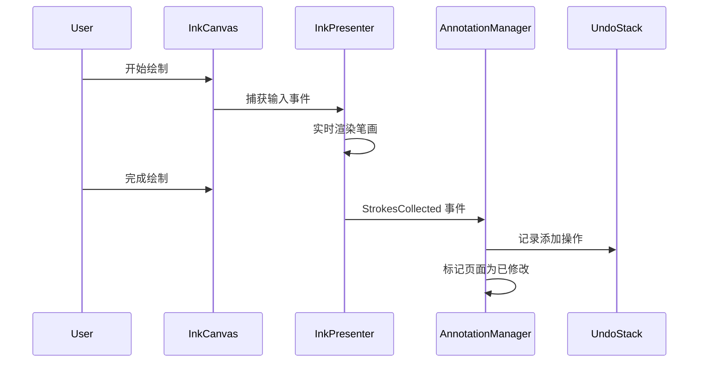
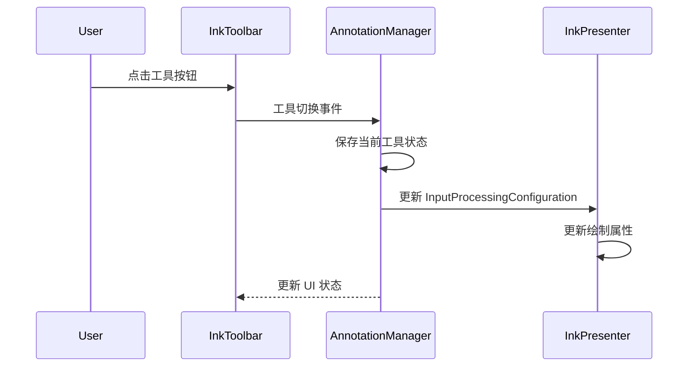
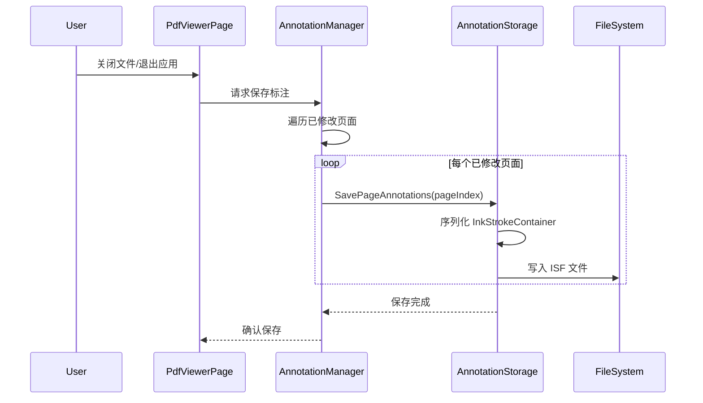
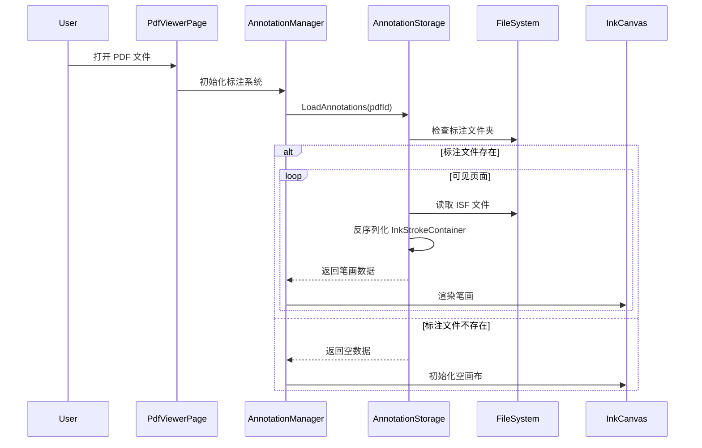

# PDF 标注功能设计文档

## Overview

### 功能概述

PDF 标注功能为 FluentPDF 应用程序提供与 Microsoft Edge 浏览器一致的标注体验，支持三种核心标注工具：荧光笔、硬笔和橡皮擦。该功能基于 UWP InkCanvas 和 InkPresenter API 构建，充分利用 Windows Ink 平台的低延迟和高性能特性。

### 设计目标

1. **性能优先**：实现 60 FPS 的流畅绘制体验，工具切换响应时间不超过 100ms
2. **无缝集成**：与现有 PdfViewerPage 组件深度集成，保持所有现有功能（缩放、滚动、旋转、单双页切换）
3. **多输入支持**：完整支持触控笔（含压感和橡皮擦端）、鼠标和触摸输入
4. **数据持久化**：使用 ISF (Ink Serialized Format) 格式保存标注数据，确保跨会话的数据完整性
5. **用户体验一致性**：遵循 Microsoft Edge 和 Windows InkToolbar 的设计语言和交互模式

### 技术选型

- **InkCanvas**：UWP 平台的墨迹画布控件，提供硬件加速的笔迹渲染
- **InkPresenter**：管理输入处理、笔迹识别和渲染管线
- **InkStrokeContainer**：管理笔画集合，提供 ISF 序列化和反序列化
- **ISF 格式**：Windows Ink 标准序列化格式，包含完整的笔画元数据（路径点、颜色、粗细、压感、倾斜角度）

### 关键约束

1. **内存管理**：仅加载可见页面和相邻页面的标注数据，避免大文件内存溢出
2. **线程安全**：所有 UI 操作必须在 UI 线程执行，文件 I/O 使用异步操作
3. **向后兼容**：不影响现有 PDF 查看器的任何功能
4. **错误恢复**：标注数据损坏时能够优雅降级，不影响 PDF 查看

## Architecture

### 系统架构

PDF 标注系统采用分层架构，从上到下分为以下层次：

```
┌─────────────────────────────────────────────────────────────┐
│                    UI Layer (XAML)                          │
│  ┌──────────────┐  ┌──────────────┐  ┌──────────────┐     │
│  │ InkToolbar   │  │ InkCanvas    │  │ Undo/Redo    │     │
│  │ (工具选择)    │  │ (标注层)      │  │ (按钮)        │     │
│  └──────────────┘  └──────────────┘  └──────────────┘     │
└─────────────────────────────────────────────────────────────┘
                            ↓
┌─────────────────────────────────────────────────────────────┐
│              Annotation Management Layer                    │
│  ┌──────────────────────────────────────────────────────┐  │
│  │         AnnotationManager (核心协调器)                │  │
│  │  - 工具状态管理                                        │  │
│  │  - 页面标注数据管理                                    │  │
│  │  - 撤销/重做栈管理                                     │  │
│  └──────────────────────────────────────────────────────┘  │
└─────────────────────────────────────────────────────────────┘
                            ↓
┌─────────────────────────────────────────────────────────────┐
│                Storage Layer                                │
│  ┌──────────────────────────────────────────────────────┐  │
│  │         AnnotationStorage (持久化管理)                │  │
│  │  - ISF 文件读写                                        │  │
│  │  - 文件命名和路径管理                                  │  │
│  │  - 异步 I/O 操作                                       │  │
│  └──────────────────────────────────────────────────────┘  │
└─────────────────────────────────────────────────────────────┘
                            ↓
┌─────────────────────────────────────────────────────────────┐
│                File System                                  │
│  LocalFolder/Annotations/{PDF_ID}/page_{index}.isf          │
└─────────────────────────────────────────────────────────────┘
```

### 组件交互流程

#### 1. 标注绘制流程



#### 2. 工具切换流程



#### 3. 标注保存流程



#### 4. 标注加载流程



### 页面级标注管理

每个 PDF 页面拥有独立的标注层和数据容器：

```
PdfPageItem (现有)
    ├── DisplayWidth, DisplayHeight (现有)
    ├── RotationDegrees (现有)
    └── AnnotationData (新增)
            ├── InkCanvas (UI 控件)
            ├── InkStrokeContainer (数据容器)
            ├── IsModified (脏标记)
            └── IsLoaded (加载状态)
```

### 与现有系统集成

标注系统与现有 PdfViewerPage 的集成点：

1. **XAML 层集成**：
   - 在 PagesRepeater 的 DataTemplate 中为每个 PdfPageView 添加 InkCanvas 覆盖层
   - 在 Toolbar 中添加 InkToolbar 和撤销/重做按钮

2. **缩放同步**：
   - 监听 PdfScrollViewer.ViewChanged 事件
   - 同步更新所有 InkCanvas 的 Width 和 Height
   - InkPresenter 自动处理笔画的缩放变换

3. **旋转同步**：
   - 监听 RotateButton_Click 事件
   - 对每个页面的 InkCanvas 应用 RotateTransform
   - 保持笔画相对于 PDF 内容的正确方向

4. **页面切换**：
   - 监听 PdfScrollViewer 的滚动事件
   - 延迟加载进入视口的页面标注
   - 卸载离开视口的页面标注（保留数据）

5. **文件生命周期**：
   - 在 LoadFileAsync 中初始化标注系统
   - 在文件关闭时保存所有已修改的标注
   - 在 CancelAll 中清理标注资源


## Components and Interfaces

### 核心组件

#### 1. AnnotationManager

**职责**：标注系统的核心协调器，管理工具状态、页面标注数据和撤销/重做栈。

**接口定义**：

```csharp
public sealed class AnnotationManager : IDisposable
{
    // ── 初始化 ──
    public AnnotationManager(PdfViewerPage pdfViewer);
    public void Initialize(string pdfId, uint pageCount);
    public void Dispose();

    // ── 工具管理 ──
    public AnnotationTool CurrentTool { get; }
    public void SetTool(AnnotationTool tool);
    public void SetToolColor(Color color);
    public void SetToolSize(InkDrawingAttributes.PenTip penTip, double size);
    
    // ── 页面标注管理 ──
    public PageAnnotationData GetPageAnnotation(uint pageIndex);
    public void AttachInkCanvas(uint pageIndex, InkCanvas inkCanvas);
    public void DetachInkCanvas(uint pageIndex);
    
    // ── 撤销/重做 ──
    public bool CanUndo { get; }
    public bool CanRedo { get; }
    public void Undo();
    public void Redo();
    
    // ── 持久化 ──
    public Task SaveAllAsync();
    public Task LoadPageAsync(uint pageIndex);
    
    // ── 事件 ──
    public event EventHandler<ToolChangedEventArgs> ToolChanged;
    public event EventHandler<UndoRedoStateChangedEventArgs> UndoRedoStateChanged;
}
```

**关键方法说明**：

- `Initialize(pdfId, pageCount)`：初始化标注系统，创建页面标注数据容器，启动后台加载任务
- `SetTool(tool)`：切换标注工具，更新 InkPresenter 的 InputProcessingConfiguration
- `AttachInkCanvas(pageIndex, inkCanvas)`：将 InkCanvas 与页面标注数据绑定，设置 InkPresenter 属性
- `SaveAllAsync()`：遍历所有已修改的页面，调用 AnnotationStorage 保存
- `LoadPageAsync(pageIndex)`：异步加载指定页面的标注数据

#### 2. PageAnnotationData

**职责**：封装单个页面的标注数据和状态。

**接口定义**：

```csharp
public sealed class PageAnnotationData
{
    // ── 数据容器 ──
    public InkStrokeContainer StrokeContainer { get; }
    
    // ── UI 绑定 ──
    public InkCanvas? AttachedCanvas { get; private set; }
    
    // ── 状态标记 ──
    public bool IsModified { get; set; }
    public bool IsLoaded { get; set; }
    
    // ── 页面信息 ──
    public uint PageIndex { get; }
    
    // ── 方法 ──
    public void AttachCanvas(InkCanvas canvas);
    public void DetachCanvas();
    public void ApplyStrokesToCanvas();
    public IReadOnlyList<InkStroke> GetStrokes();
}
```

**关键方法说明**：

- `AttachCanvas(canvas)`：将 InkCanvas 与数据容器绑定，设置 InkPresenter.StrokeContainer
- `ApplyStrokesToCanvas()`：将 StrokeContainer 中的笔画渲染到 InkCanvas
- `GetStrokes()`：返回当前页面的所有笔画，用于撤销/重做

#### 3. AnnotationStorage

**职责**：管理标注数据的持久化，处理 ISF 文件的读写。

**接口定义**：

```csharp
public sealed class AnnotationStorage
{
    // ── 初始化 ──
    public AnnotationStorage(string pdfId);
    
    // ── 文件路径管理 ──
    public string GetAnnotationFolderPath();
    public string GetPageAnnotationFilePath(uint pageIndex);
    
    // ── 保存 ──
    public Task SavePageAsync(uint pageIndex, InkStrokeContainer container);
    public Task SaveAllAsync(IEnumerable<PageAnnotationData> pages);
    
    // ── 加载 ──
    public Task<InkStrokeContainer?> LoadPageAsync(uint pageIndex);
    public Task<bool> HasAnnotationsAsync(uint pageIndex);
    
    // ── 删除 ──
    public Task DeletePageAsync(uint pageIndex);
    public Task DeleteAllAsync();
}
```

**关键方法说明**：

- `SavePageAsync(pageIndex, container)`：将 InkStrokeContainer 序列化为 ISF 格式并保存到文件
- `LoadPageAsync(pageIndex)`：从 ISF 文件加载笔画数据并反序列化为 InkStrokeContainer
- `GetPageAnnotationFilePath(pageIndex)`：生成标注文件路径，格式为 `LocalFolder/Annotations/{PDF_ID}/page_{index}.isf`

#### 4. UndoRedoManager

**职责**：管理撤销/重做栈，记录标注操作历史。

**接口定义**：

```csharp
public sealed class UndoRedoManager
{
    // ── 栈管理 ──
    public bool CanUndo { get; }
    public bool CanRedo { get; }
    public int UndoStackCount { get; }
    public int RedoStackCount { get; }
    
    // ── 操作记录 ──
    public void RecordAddStrokes(uint pageIndex, IReadOnlyList<InkStroke> strokes);
    public void RecordRemoveStrokes(uint pageIndex, IReadOnlyList<InkStroke> strokes);
    
    // ── 撤销/重做 ──
    public AnnotationOperation? Undo();
    public AnnotationOperation? Redo();
    
    // ── 清空 ──
    public void Clear();
    public void ClearRedoStack();
    
    // ── 事件 ──
    public event EventHandler StateChanged;
}
```

**操作类型定义**：

```csharp
public enum AnnotationOperationType
{
    AddStrokes,
    RemoveStrokes
}

public sealed class AnnotationOperation
{
    public AnnotationOperationType Type { get; }
    public uint PageIndex { get; }
    public IReadOnlyList<InkStroke> Strokes { get; }
}
```

**关键方法说明**：

- `RecordAddStrokes(pageIndex, strokes)`：记录添加笔画操作到撤销栈，清空重做栈
- `Undo()`：从撤销栈弹出操作，执行反向操作，将操作压入重做栈
- `Redo()`：从重做栈弹出操作，重新执行操作，将操作压入撤销栈

### UI 组件

#### 1. InkCanvas 集成

在 PdfPageView 的 XAML 中添加 InkCanvas 覆盖层：

```xml
<Grid x:Name="PageContainer">
    <!-- 现有的 PDF 渲染层 -->
    <Image x:Name="Layer2Image" ... />
    <Image x:Name="Layer1Image" ... />
    
    <!-- 新增：标注层 -->
    <InkCanvas x:Name="AnnotationCanvas"
               Width="{Binding DisplayWidth}"
               Height="{Binding DisplayHeight}"
               Background="Transparent"
               HorizontalAlignment="Center"
               VerticalAlignment="Center" />
</Grid>
```

**InkCanvas 配置**：

```csharp
// 在 PdfPageView.xaml.cs 中
public void InitializeAnnotationCanvas(PageAnnotationData annotationData)
{
    // 绑定数据容器
    AnnotationCanvas.InkPresenter.StrokeContainer = annotationData.StrokeContainer;
    
    // 配置输入处理
    AnnotationCanvas.InkPresenter.InputDeviceTypes = 
        CoreInputDeviceTypes.Mouse | 
        CoreInputDeviceTypes.Pen | 
        CoreInputDeviceTypes.Touch;
    
    // 监听笔画事件
    AnnotationCanvas.InkPresenter.StrokesCollected += OnStrokesCollected;
    AnnotationCanvas.InkPresenter.StrokesErased += OnStrokesErased;
}
```

#### 2. InkToolbar 集成

在 PdfViewerPage 的工具栏中添加标注工具：

```xml
<StackPanel x:Name="Toolbar" Orientation="Horizontal" Spacing="8">
    <!-- 现有按钮 -->
    <Button x:Name="CatalogButton" ... />
    
    <!-- 新增：撤销/重做按钮 -->
    <Button x:Name="UndoButton"
            Content="&#xE7A7;"
            ToolTipService.ToolTip="撤销 (Ctrl+Z)"
            IsEnabled="{x:Bind AnnotationManager.CanUndo, Mode=OneWay}"
            Click="UndoButton_Click" />
    
    <Button x:Name="RedoButton"
            Content="&#xE7A6;"
            ToolTipService.ToolTip="重做 (Ctrl+Y)"
            IsEnabled="{x:Bind AnnotationManager.CanRedo, Mode=OneWay}"
            Click="RedoButton_Click" />
    
    <!-- 视觉分隔符 -->
    <Border Width="1" Height="24" Background="{ThemeResource DividerStrokeColorDefaultBrush}" />
    
    <!-- 新增：标注工具 -->
    <InkToolbarCustomPenButton x:Name="HighlighterButton"
                               ToolTipService.ToolTip="荧光笔"
                               ConfigurationContent="{StaticResource HighlighterConfiguration}">
        <SymbolIcon Symbol="Highlight" />
    </InkToolbarCustomPenButton>
    
    <InkToolbarCustomPenButton x:Name="PenButton"
                               ToolTipService.ToolTip="硬笔"
                               ConfigurationContent="{StaticResource PenConfiguration}">
        <SymbolIcon Symbol="Edit" />
    </InkToolbarCustomPenButton>
    
    <InkToolbarEraserButton x:Name="EraserButton"
                            ToolTipService.ToolTip="橡皮擦" />
    
    <!-- 现有按钮 -->
    <Button x:Name="ZoomInButton" ... />
    ...
</StackPanel>
```

**工具配置面板**：

```xml
<!-- 荧光笔配置 -->
<StackPanel x:Key="HighlighterConfiguration" Orientation="Vertical" Spacing="8">
    <TextBlock Text="颜色" Style="{StaticResource CaptionTextBlockStyle}" />
    <GridView x:Name="HighlighterColorPalette"
              SelectionMode="Single"
              ItemsSource="{x:Bind HighlighterColors}">
        <GridView.ItemTemplate>
            <DataTemplate x:DataType="Color">
                <Ellipse Width="24" Height="24" Fill="{x:Bind Converter={StaticResource ColorToBrushConverter}}" />
            </DataTemplate>
        </GridView.ItemTemplate>
    </GridView>
    
    <TextBlock Text="粗细" Style="{StaticResource CaptionTextBlockStyle}" />
    <Slider x:Name="HighlighterSizeSlider"
            Minimum="8" Maximum="24" StepFrequency="8"
            Value="16" />
</StackPanel>

<!-- 硬笔配置 -->
<StackPanel x:Key="PenConfiguration" Orientation="Vertical" Spacing="8">
    <TextBlock Text="颜色" Style="{StaticResource CaptionTextBlockStyle}" />
    <GridView x:Name="PenColorPalette"
              SelectionMode="Single"
              ItemsSource="{x:Bind PenColors}">
        <GridView.ItemTemplate>
            <DataTemplate x:DataType="Color">
                <Ellipse Width="24" Height="24" Fill="{x:Bind Converter={StaticResource ColorToBrushConverter}}" />
            </DataTemplate>
        </GridView.ItemTemplate>
    </GridView>
    
    <TextBlock Text="粗细" Style="{StaticResource CaptionTextBlockStyle}" />
    <Slider x:Name="PenSizeSlider"
            Minimum="1" Maximum="8" StepFrequency="1"
            Value="2" />
</StackPanel>
```

### 工具状态管理

#### AnnotationTool 枚举

```csharp
public enum AnnotationTool
{
    None,        // 无工具（查看模式）
    Highlighter, // 荧光笔
    Pen,         // 硬笔
    Eraser       // 橡皮擦
}
```

#### 工具配置

```csharp
public sealed class ToolConfiguration
{
    // 荧光笔预设
    public static readonly Color[] HighlighterColors = new[]
    {
        Color.FromArgb(128, 255, 255, 0),  // 黄色
        Color.FromArgb(128, 0, 255, 0),    // 绿色
        Color.FromArgb(128, 0, 191, 255),  // 蓝色
        Color.FromArgb(128, 255, 105, 180) // 粉色
    };
    
    public static readonly double[] HighlighterSizes = new[] { 8.0, 16.0, 24.0 };
    
    // 硬笔预设
    public static readonly Color[] PenColors = new[]
    {
        Colors.Black,
        Colors.Red,
        Colors.Blue,
        Colors.Green,
        Colors.Yellow,
        Colors.White
    };
    
    public static readonly double[] PenSizes = new[] { 1.0, 2.0, 4.0 };
    
    // 橡皮擦预设
    public static readonly double[] EraserSizes = new[] { 16.0, 32.0 };
}
```

## Data Models

### 1. 标注数据结构

#### InkStroke（UWP 内置）

UWP 平台提供的 InkStroke 类包含以下属性：

```csharp
public sealed class InkStroke
{
    // 笔画路径
    public IReadOnlyList<InkPoint> GetInkPoints();
    
    // 绘制属性
    public InkDrawingAttributes DrawingAttributes { get; set; }
    
    // 边界框
    public Rect BoundingRect { get; }
    
    // 变换
    public Matrix3x2 PointTransform { get; set; }
    
    // 识别结果（可选）
    public IReadOnlyList<string> GetRecognizedStrokes();
}
```

#### InkDrawingAttributes（UWP 内置）

```csharp
public sealed class InkDrawingAttributes
{
    // 颜色
    public Color Color { get; set; }
    
    // 尺寸
    public Size Size { get; set; }
    
    // 笔尖形状
    public PenTipShape PenTip { get; set; }
    
    // 适合触摸
    public bool FitToCurve { get; set; }
    
    // 忽略压感
    public bool IgnorePressure { get; set; }
    
    // 绘制模式
    public InkDrawingAttributesKind Kind { get; set; }
}
```

### 2. 页面标注数据模型

```csharp
public sealed class PageAnnotationData
{
    // ── 核心数据 ──
    public uint PageIndex { get; }
    public InkStrokeContainer StrokeContainer { get; }
    
    // ── UI 绑定 ──
    public InkCanvas? AttachedCanvas { get; private set; }
    
    // ── 状态标记 ──
    public bool IsModified { get; set; }
    public bool IsLoaded { get; set; }
    
    // ── 构造函数 ──
    public PageAnnotationData(uint pageIndex)
    {
        PageIndex = pageIndex;
        StrokeContainer = new InkStrokeContainer();
        IsModified = false;
        IsLoaded = false;
    }
    
    // ── 方法 ──
    public void AttachCanvas(InkCanvas canvas)
    {
        AttachedCanvas = canvas;
        canvas.InkPresenter.StrokeContainer = StrokeContainer;
    }
    
    public void DetachCanvas()
    {
        if (AttachedCanvas != null)
        {
            AttachedCanvas.InkPresenter.StrokeContainer = new InkStrokeContainer();
            AttachedCanvas = null;
        }
    }
    
    public void ApplyStrokesToCanvas()
    {
        if (AttachedCanvas != null && IsLoaded)
        {
            AttachedCanvas.InkPresenter.StrokeContainer = StrokeContainer;
        }
    }
    
    public IReadOnlyList<InkStroke> GetStrokes()
    {
        return StrokeContainer.GetStrokes();
    }
}
```

### 3. 撤销/重做操作模型

```csharp
public enum AnnotationOperationType
{
    AddStrokes,    // 添加笔画
    RemoveStrokes  // 删除笔画
}

public sealed class AnnotationOperation
{
    public AnnotationOperationType Type { get; }
    public uint PageIndex { get; }
    public IReadOnlyList<InkStroke> Strokes { get; }
    public DateTime Timestamp { get; }
    
    public AnnotationOperation(
        AnnotationOperationType type,
        uint pageIndex,
        IReadOnlyList<InkStroke> strokes)
    {
        Type = type;
        PageIndex = pageIndex;
        Strokes = strokes;
        Timestamp = DateTime.UtcNow;
    }
}
```

### 4. 文件存储模型

#### 文件路径结构

```
ApplicationData.Current.LocalFolder/
└── Annotations/
    └── {PDF_ID}/                    # PDF 文件的唯一标识符（SHA256 哈希）
        ├── page_0.isf               # 第 0 页的标注数据
        ├── page_1.isf               # 第 1 页的标注数据
        ├── page_2.isf               # 第 2 页的标注数据
        └── ...
```

#### PDF 文件标识符生成

```csharp
public static string GeneratePdfId(StorageFile pdfFile)
{
    // 使用文件路径和修改时间生成唯一标识符
    string input = $"{pdfFile.Path}_{pdfFile.DateCreated.Ticks}";
    using (var sha256 = SHA256.Create())
    {
        byte[] hash = sha256.ComputeHash(Encoding.UTF8.GetBytes(input));
        return BitConverter.ToString(hash).Replace("-", "").ToLowerInvariant();
    }
}
```

#### ISF 文件格式

ISF (Ink Serialized Format) 是 Windows Ink 的标准序列化格式，本质上是包含墨迹元数据的 GIF 文件。ISF 格式包含：

- **笔画路径点**：每个点的 X、Y 坐标
- **压感数据**：触控笔的压力值（0.0 到 1.0）
- **倾斜角度**：触控笔的倾斜角度（X 和 Y 方向）
- **绘制属性**：颜色、粗细、笔尖形状、透明度
- **时间戳**：每个点的时间戳（用于笔画重放）

**序列化示例**：

```csharp
public async Task SavePageAsync(uint pageIndex, InkStrokeContainer container)
{
    string filePath = GetPageAnnotationFilePath(pageIndex);
    StorageFolder folder = await GetOrCreateAnnotationFolderAsync();
    StorageFile file = await folder.CreateFileAsync(
        $"page_{pageIndex}.isf",
        CreationCollisionOption.ReplaceExisting);
    
    using (IRandomAccessStream stream = await file.OpenAsync(FileAccessMode.ReadWrite))
    {
        await container.SaveAsync(stream);
    }
}
```

**反序列化示例**：

```csharp
public async Task<InkStrokeContainer?> LoadPageAsync(uint pageIndex)
{
    try
    {
        string filePath = GetPageAnnotationFilePath(pageIndex);
        StorageFolder folder = await GetAnnotationFolderAsync();
        StorageFile file = await folder.GetFileAsync($"page_{pageIndex}.isf");
        
        var container = new InkStrokeContainer();
        using (IRandomAccessStream stream = await file.OpenAsync(FileAccessMode.Read))
        {
            await container.LoadAsync(stream);
        }
        
        return container;
    }
    catch (FileNotFoundException)
    {
        return null;
    }
}
```

### 5. 工具状态模型

```csharp
public sealed class ToolState
{
    // 当前工具
    public AnnotationTool CurrentTool { get; set; }
    
    // 荧光笔状态
    public Color HighlighterColor { get; set; }
    public double HighlighterSize { get; set; }
    
    // 硬笔状态
    public Color PenColor { get; set; }
    public double PenSize { get; set; }
    
    // 橡皮擦状态
    public double EraserSize { get; set; }
    
    // 默认值
    public ToolState()
    {
        CurrentTool = AnnotationTool.None;
        HighlighterColor = Color.FromArgb(128, 255, 255, 0); // 黄色
        HighlighterSize = 16.0;
        PenColor = Colors.Black;
        PenSize = 2.0;
        EraserSize = 16.0;
    }
}
```

### 6. 内存管理模型

为了避免大文件内存溢出，标注系统采用延迟加载和卸载策略：

```csharp
public sealed class AnnotationMemoryManager
{
    // 缓存策略
    private const int MaxLoadedPages = 5;  // 最多同时加载 5 个页面的标注
    private readonly Queue<uint> _loadedPages = new();
    
    // 加载页面标注
    public async Task LoadPageIfNeededAsync(uint pageIndex)
    {
        if (_loadedPages.Contains(pageIndex))
            return;
        
        // 如果超过缓存上限，卸载最旧的页面
        if (_loadedPages.Count >= MaxLoadedPages)
        {
            uint oldestPage = _loadedPages.Dequeue();
            await UnloadPageAsync(oldestPage);
        }
        
        // 加载新页面
        await LoadPageAsync(pageIndex);
        _loadedPages.Enqueue(pageIndex);
    }
    
    // 卸载页面标注
    private async Task UnloadPageAsync(uint pageIndex)
    {
        var pageData = GetPageAnnotation(pageIndex);
        
        // 如果页面已修改，先保存
        if (pageData.IsModified)
        {
            await _storage.SavePageAsync(pageIndex, pageData.StrokeContainer);
            pageData.IsModified = false;
        }
        
        // 清空内存中的笔画数据
        pageData.StrokeContainer.Clear();
        pageData.IsLoaded = false;
    }
}
```

